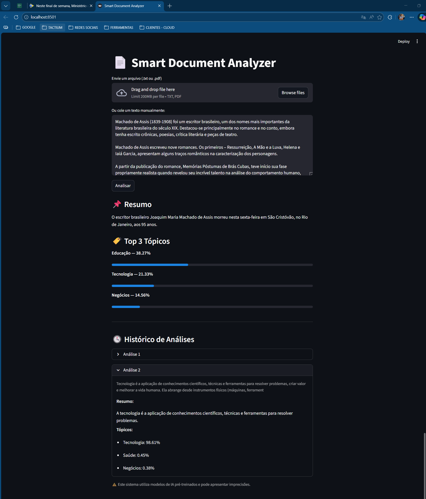

# 📄 Smart Document Analyzer


## 📌 Descrição
Este projeto é uma aplicação web interativa desenvolvida com **Streamlit** que utiliza modelos de **Deep Learning** da biblioteca Transformers para análise inteligente de documentos e textos.

A aplicação utiliza arquiteturas de ponta para:
- **Resumo Automático:** Extração das ideias centrais de textos longos.
- **Classificação Zero-Shot:** Identificação de tópicos sem necessidade de treinamento específico para as categorias.
- **Processamento de Documentos:** Suporte nativo para leitura de arquivos PDF e TXT.
- **Gestão de Sessão:** Histórico persistente das análises realizadas durante a execução.

---

## 🖼️ Interface da Aplicação

Localizada na pasta `Imagens_Dash/`, a imagem abaixo demonstra o funcionamento da interface:



---

## 🧠 Tecnologias Utilizadas

* **Linguagem:** Python 3.11
* **Interface Web:** Streamlit
* **Modelos de IA (NLP):** * `mT5` (Multilingual T5) para sumarização.
    * `mDeBERTa-v3` para classificação de tópicos.
* **Framework de Deep Learning:** PyTorch
* **Manipulação de PDF:** pypdf

---

## ⚙️ Funcionalidades

- [x] Upload de arquivos `.txt` e `.pdf`.
- [x] Entrada manual de texto via área de transferência.
- [x] Geração de resumos em tempo real.
- [x] Classificação em categorias (Tecnologia, Educação, Negócios, Saúde, Ciência).
- [x] Visualização de confiança através de barras de progresso.
- [x] Histórico de análises com função de expansão.

---

## 🚀 Como Executar o Projeto

### 1. Clone o repositório
```bash
git clone [https://github.com/seu-usuario/nome-do-repositorio.git](https://github.com/seu-usuario/nome-do-repositorio.git)
cd nome-do-repositorio

# Criar ambiente
python -m venv dl_env

# Ativar no Windows
.\dl_env\Scripts\activate

# Ativar no Linux/Mac
source dl_env/bin/activate

# Instalar dependências
pip install -r requirements.txt

# Executar aplicação
streamlit run Api.py
